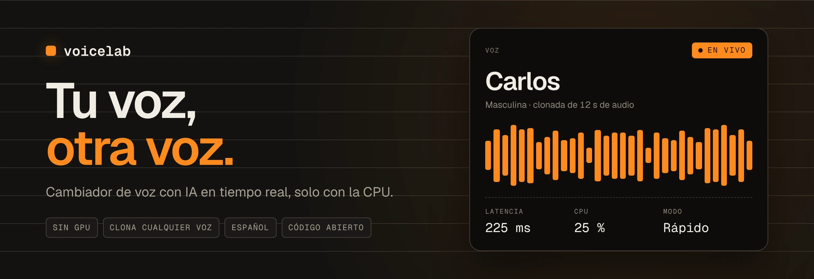
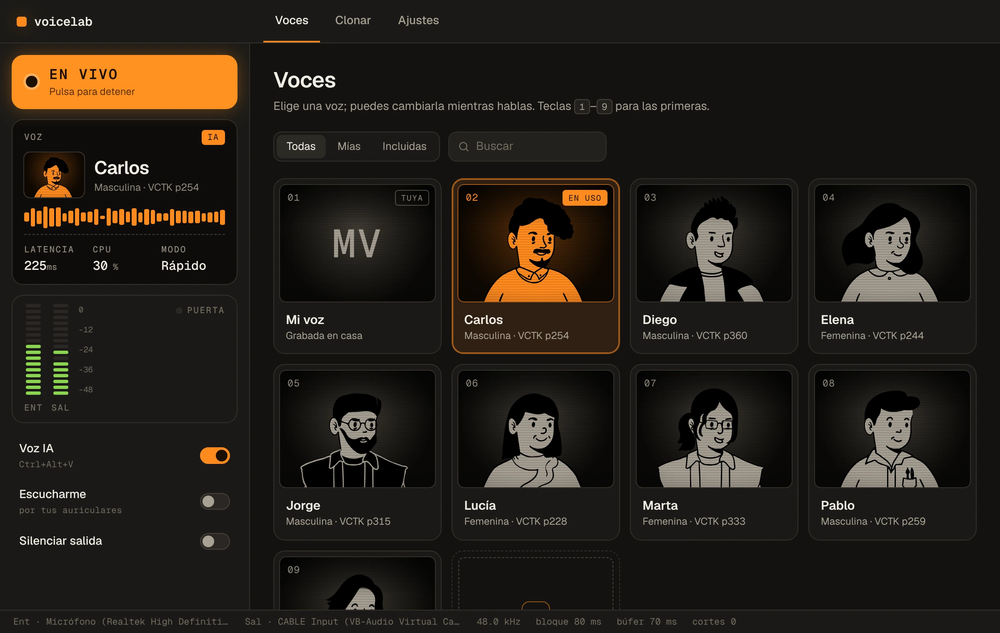
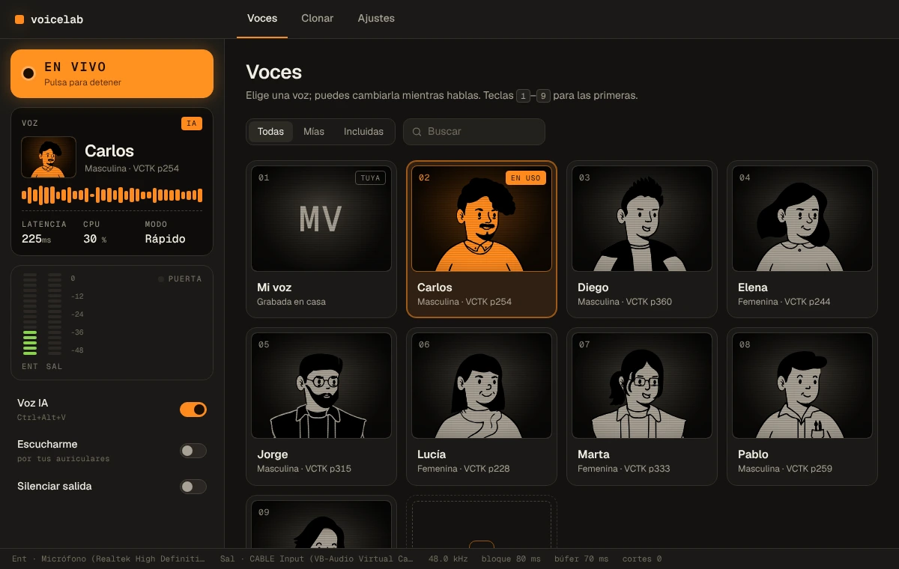
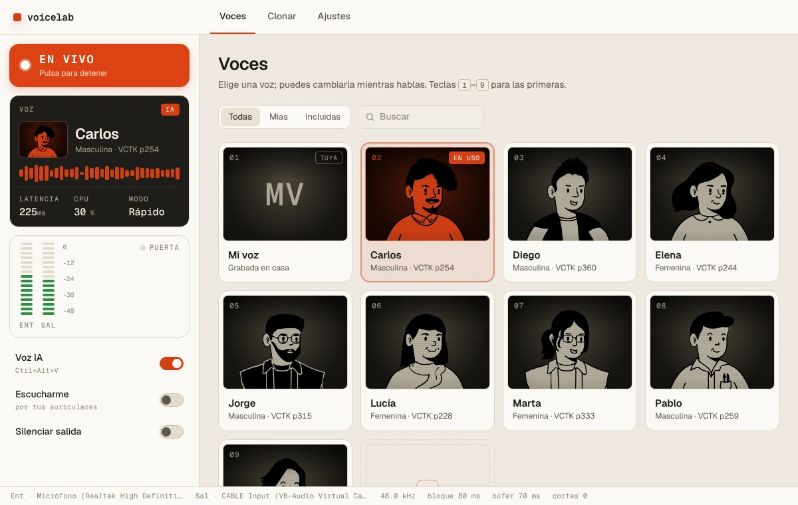
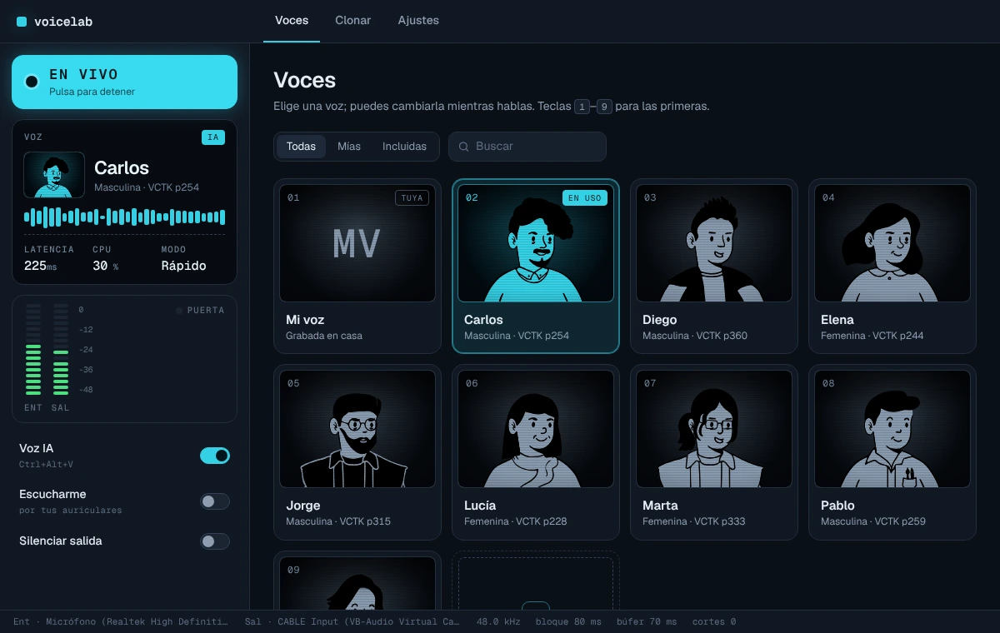
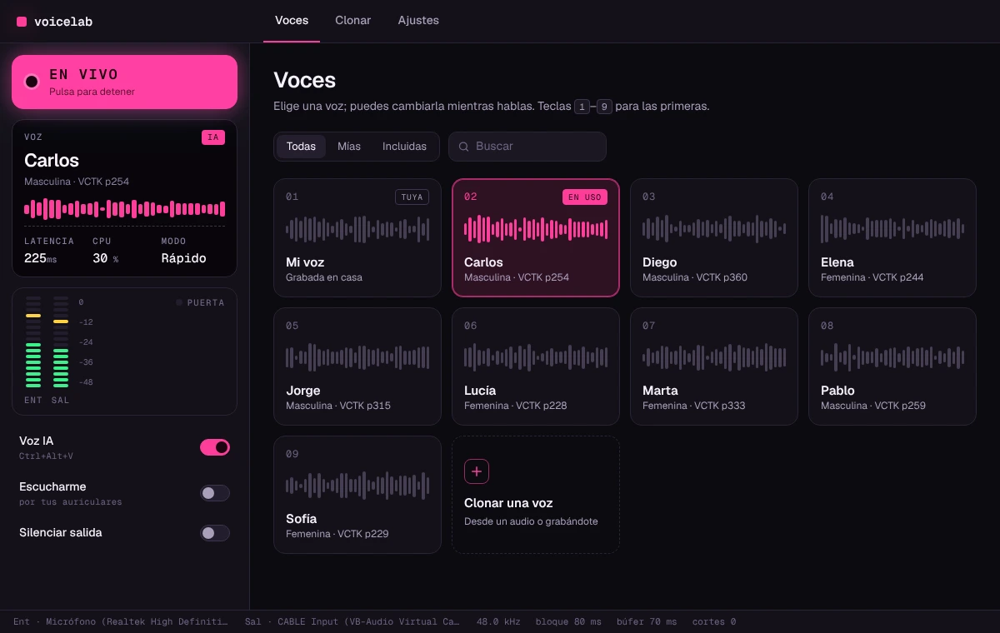
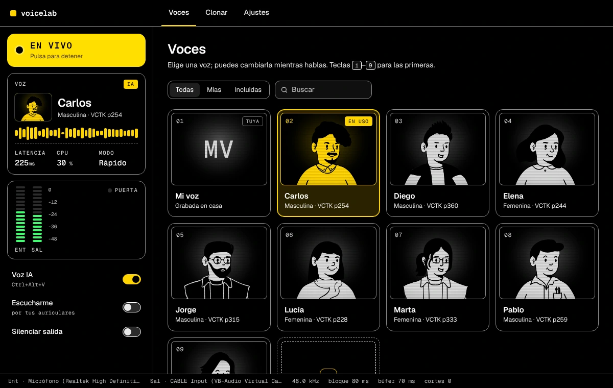
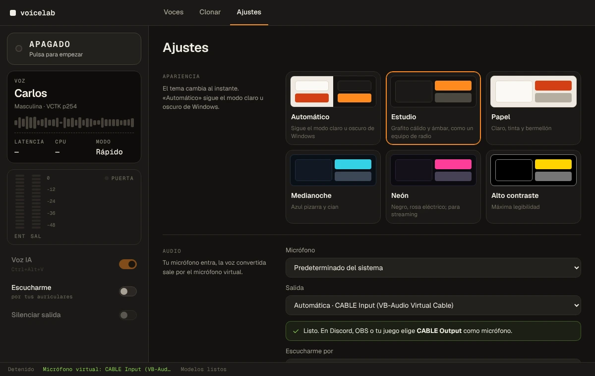
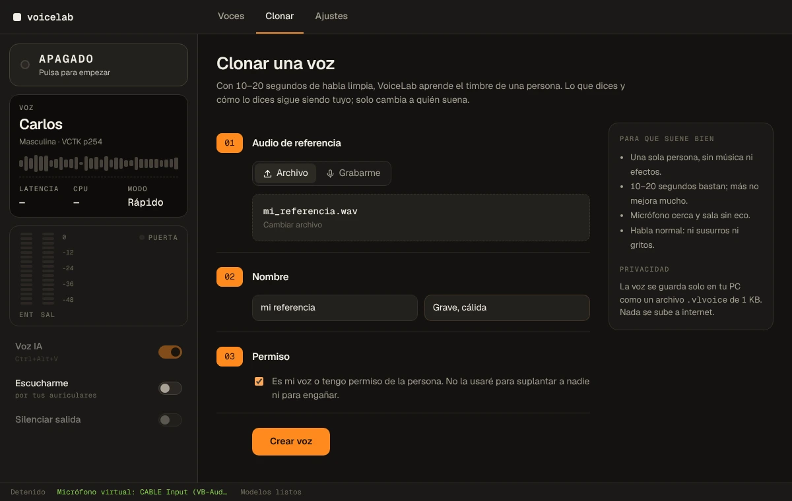
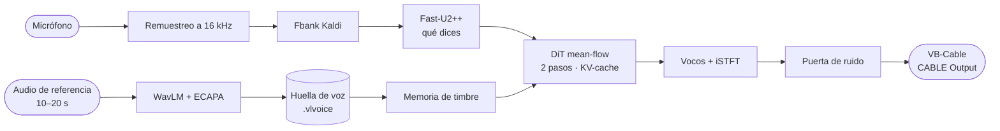

<p align="center">
  
</p>

<p align="center">
  <a href="https://github.com/AnonymoDGH/voicelab/actions/workflows/ci.yml"></a>
  
  
  
  
</p>

<p align="center">
  <a href="https://github.com/AnonymoDGH/voicelab/releases/latest"><b>Descargar para Windows</b></a> ·
  <a href="#empezar">Empezar</a> ·
  <a href="#escúchalo">Escúchalo</a> ·
  <a href="#temas">Temas</a> ·
  <a href="#rendimiento">Rendimiento</a> ·
  <a href="#cómo-funciona">Cómo funciona</a> ·
  <a href="#compilar">Compilar</a>
</p>

**VoiceLab** cambia tu voz por la de otra persona **mientras hablas**, usando solo el procesador.
Hablas por tu micrófono y en Discord, OBS o tu juego suenas con otra voz. Es una alternativa
abierta a Voicemod, en español y sin enviar nada a internet.

<p align="center">
  
</p>

## Qué hace

- **Voces clonadas, no filtros.** No es un pitch-shift con efectos: una red neuronal reconstruye tu
  voz con el timbre de otra persona y conserva lo que dices y cómo lo dices.
- **Clona cualquier voz con 10–20 segundos.** Desde un archivo o grabándote. No hay que entrenar nada.
- **Funciona en un i5 sin GPU.** Usa un solo hilo de CPU; hay margen de sobra para jugar o emitir.
- **Sale como un micrófono más.** Con [VB-Cable](https://vb-audio.com/Cable/), cualquier programa la elige como micrófono.
- **Cambia de voz sin cortar.** Las teclas `1`–`9` eligen voz y `Ctrl+Alt+V` alterna voz IA ↔ tu voz desde cualquier app.
- **Privado.** Todo corre en tu PC. Cada voz es un archivo `.vlvoice` de 1 KB.

## Escúchalo

Una misma frase en español, convertida por el motor de VoiceLab (archivos de 12 s):

| | |
|---|---|
| Entrada | [original.wav](docs/audio/original.wav) (voz sintética generada con [pocket-tts](https://github.com/kyutai-labs/pocket-tts)) |
| Como **Carlos**, modo Calidad | [convertida-carlos.wav](docs/audio/convertida-carlos.wav) |
| Como **Lucía**, modo Rápido | [convertida-lucia.wav](docs/audio/convertida-lucia.wav) |

## Empezar

1. Instala [VB-Cable](https://vb-audio.com/Cable/) (gratis) y reinicia Windows.
2. Descarga el instalador de la [última versión](https://github.com/AnonymoDGH/voicelab/releases/latest)
   y ábrelo. La primera vez descarga los modelos de IA (~700 MB, una sola vez).
3. Elige una voz, o clona la tuya en **Clonar**, y pulsa **EN VIVO**.
4. En Discord, OBS o tu juego elige **CABLE Output** como micrófono.

Para oírte mientras hablas, activa **Escucharme** con auriculares.

## Temas

Seis temas, con vista previa real en **Ajustes → Apariencia**. *Automático* sigue el modo claro u
oscuro de Windows.

<table>
  <tr>
    <td width="33%"><br><b>Estudio</b>: grafito cálido y ámbar</td>
    <td width="33%"><br><b>Papel</b>: claro, tinta y bermellón</td>
    <td width="33%"><br><b>Medianoche</b>: azul pizarra y cian</td>
  </tr>
  <tr>
    <td><br><b>Neón</b>: rosa eléctrico, para streaming</td>
    <td><br><b>Alto contraste</b>: máxima legibilidad</td>
    <td><br><b>Ajustes</b>: elige el tuyo</td>
  </tr>
</table>

## Clonar una voz



Elige un audio de 10–20 s de una sola persona hablando (wav, mp3, flac u ogg), o grábate desde el
micrófono. VoiceLab calcula su **huella de voz** y la guarda como archivo `.vlvoice`. Las barras de
cada tarjeta son esa huella dibujada: voces parecidas se parecen.

Solo con tu voz o con permiso de la persona; lee [Uso responsable](#uso-responsable).

## Rendimiento

Medido con `voicelab bench` (1 hilo de CPU, Intel Xeon a 2.1 GHz, más lento por núcleo que un i5
de escritorio actual):

| Modo | Bloque | Latencia del modelo¹ | Tiempo por bloque (p50 / p99) | RTF² |
|---|---|---|---|---|
| **Rápido** | 80 ms | ~225 ms | 20 / 24 ms | 0.25 |
| **Calidad** | 160 ms | ~305 ms | 18 / 30 ms | 0.12 |

¹ Algoritmo más margen de búfer. El driver de audio suma unos 10–30 ms.
² Tiempo de cálculo dividido entre la duración del audio. Por debajo de 1 hay tiempo real; 0.25 deja el 75 % de margen.

En nuestras pruebas, Whisper reconoce igual que en el original el 94–100 % de las palabras del
español convertido. Comprueba tu PC:

```sh
voicelab bench
```

## Cómo funciona



- **Modelo:** [MeanVC2](https://github.com/ASLP-lab/MeanVC2) (Apache-2.0) exportado a ONNX. El DiT
  tiene 18 M parámetros y hace los dos pasos de *mean flow* en un solo grafo con KV-cache de tamaño
  fijo. Corre con ONNX Runtime desde Rust, unas 3 veces más rápido que PyTorch en CPU.
- **Audio:** `cpal` (WASAPI en Windows), buffers sin bloqueos (`rtrb`) y el modelo en su propio
  hilo. Compensa la deriva de reloj entre el micrófono y la salida.
- **Paridad verificada:** cada grafo ONNX se compara con PyTorch y el motor Rust con la
  especificación Python, etapa por etapa (SNR de salida de 76–80 dB).
- **Interfaz:** Tauri 2 + Svelte 5.
- **Inspiración:** [pocket-tts](https://github.com/kyutai-labs/pocket-tts) de Kyutai: CPU primero,
  estados de voz precalculados en archivos y modelos que se descargan en el primer arranque.

## Línea de comandos

```sh
voicelab download-models                          # modelos de IA (~700 MB, una vez)
voicelab devices                                  # micrófonos y salidas (marca VB-Cable)
voicelab bench                                    # ¿llega tu CPU a tiempo real?
voicelab run --voice carlos                       # micrófono -> voz IA -> VB-Cable
voicelab run --voice carlos --monitor "Auriculares"
voicelab convert entrada.wav salida.wav --voice lucia
voicelab clone-voice referencia.mp3 --name "Mi voz"
voicelab voices
```

## Compilar

Requisitos: Rust estable y Node 20 o superior. En Linux también `libasound2-dev` y las
[dependencias de Tauri](https://v2.tauri.app/start/prerequisites/).

Para publicar una versión basta con crear un tag `vX.Y.Z`: el workflow
[Release](.github/workflows/release.yml) exporta los modelos, compila el instalador en Windows y
sube todo al release.

```sh
# Motor y CLI
cargo build --release -p voicelab-cli
cargo test -p voicelab-core          # los tests del modelo necesitan VOICELAB_MODELS

# App de escritorio
cd app
npm ci
npm run tauri build                  # en Windows genera el instalador NSIS
npm run screenshots                  # regenera las imágenes de este README
```

<details>
<summary><b>Regenerar los modelos ONNX</b> (opcional)</summary>

```sh
cd tools/export
uv run python download.py                         # checkpoints de MeanVC2 y WavLM
uv run python export_onnx.py --out ../../models   # exporta y verifica contra PyTorch
uv run python quantize.py --models ../../models   # encoder de voz en int8 (1.3 GB -> 386 MB)
uv run python make_golden.py --source voz.wav --target ref.wav
uv run python make_voices.py
```

</details>

### Estructura

```
crates/voicelab-core   motor: DSP, pipeline streaming sobre ONNX, audio en tiempo real, voces
crates/voicelab-cli    binario `voicelab`
app/                   app de escritorio (Tauri + Svelte); app/media y app/scripts generan las imágenes
tools/export/          MeanVC2 -> ONNX, fixtures golden y voces incluidas (solo desarrollo)
tests/fixtures/        tensores de referencia para los tests de paridad
voices/                voces incluidas (.vlvoice)
docs/                  imágenes y audios de este README
```

## Uso responsable

Clona solo tu voz o la de personas que te hayan dado permiso. No uses VoiceLab para suplantar a
nadie, estafar ni engañar. La app pide confirmarlo antes de crear cada voz.

## Créditos y licencia

VoiceLab se publica con licencia **Apache-2.0**. Se apoya en MeanVC2 (ASLP-lab), Fast-U2++/WeNet,
Vocos, WavLM (Microsoft), el corpus VCTK (CSTR, Universidad de Edimburgo) y las tipografías Geist.
Licencias y atribuciones en [THIRD_PARTY.md](THIRD_PARTY.md) y [NOTICE](NOTICE).
